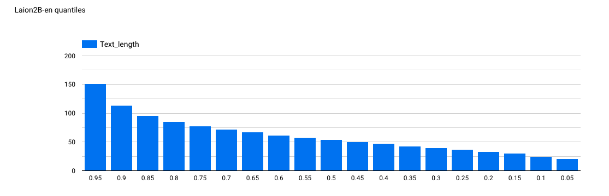

# CLIP is awesome 

## ELI5 (Explain like I'm 5 years old)
CLIP is able to connect the meaning of a text with the meaning of an image. It converts the image into a long list of numbers. It also converts the text into a long list of numbers. Now that we only have numbers (hundreds of them!), we can compare both lists and check if the meaning of the text is similar to the meaning of the image. We can ask CLIP if a dog is in the image so we don't have to check every image manually. For building CLIP, the system was teached with millions of images with its description, so it could learn from the examples.

## CLIP in a nutshell

CLIP (Contrastive Language–Image Pre-training) is a neural network which efficiently learns visual concepts from natural language supervision, through the use of Contrastive Learning. It can be used as a classification tool where we can compare the embeddings of an image 

Links:

- [CLIP: Connecting Text and Images](https://openai.com/blog/clip/)
- [CLIP paper on Arxiv: Learning Transferable Visual Models From Natural Language Supervision](https://arxiv.org/abs/2103.00020)
- [The Beginner’s Guide to Contrastive Learning](https://www.v7labs.com/blog/contrastive-learning-guide)
- [Research resources for CLIP from Zhuoning Yuan](https://github.com/yzhuoning/Awesome-CLIP/tree/main)

|  |
|:--:|
| Image Credit: https://github.com/openai/CLIP |

As seen in the picture above, during the pre-training phase, both encoders (image and text) are trained with image-text pairs and incentivized to create similar representations for the corresponding pairs (and not similar for the negative examples). For using CLIP as a Zero-Shot classifier, one will create a text that defines the class, and the will obtain its representation with the text encoder. Finally, the representation of the image is compared with each class with some distance metric (i.e. cosine similarity) and we can select the class that is closest.

## OpenCLIP

CLIP is a OpenAI product and it is available at [Github](https://github.com/openai/CLIP) but we will be using an alternative that's been trained on LAION (Large-scale Artificial Intelligence Open Network) and that provides multiple ViT sizes. OpenCLIP is provided by mlfoundations in the following repo: [https://github.com/mlfoundations/open_clip](https://github.com/mlfoundations/open_clip).

## LAION

[LAION](https://laion.ai/) is a non-profit organization that provides datasets, tools and models to liberate machine learning research. In particular, for openCLIP, it's the dataset provider for the most downloaded model, with LAION-2B (the English subset of LAION-5B). You can find the models in [HuggingFace](https://huggingface.co/collections/laion/openclip-laion-2b-64fcade42d20ced4e9389b30).

It's relevant to note that a CLIP models will be expecting a short description for the image, based on the distribution of the descriptions in the training dataset. There's an interesting work around this and the concept of "effective length": the paper "Long-CLIP: Unlocking the Long-Text Capability of CLIP" (https://lnkd.in/dky8Hf8N) puts it around 20 tokens, and concludes: "This is because the majority of training texts are likely to be considerably shorter than 77 in the original CLIP model". In fact, in the following graph one can check the quantiles for the length of the text associated with the images:

From: https://laion.ai/blog/laion-5b/#dataset-statistics

But this is not something we cannot modify, even with the bias on the dataset there are workarounds. Check the repo at https://github.com/facebookresearch/DCI (includes code to reproduce the paper [A Picture is Worth More Than 77 Text Tokens: Evaluating CLIP-Style Models on Dense Captions](https://arxiv.org/abs/2312.08578))

## Experiments

In this section I will experiment with some ideas around CLIP and will provide the notebooks.

| Demo | Description |
|:-:|:-:|
|| How cosine similarity of CLIP embeddings decrease linearly with the number of pixels replaced by a grey pixel and how a different preprocessing method can drop cosine similarity by a lot|
|| CLIP activations (in the ViT, just after the GELU) change progressively from noise to image, and how in the first block the dynamics are the opposite of the last block.|
|| How CLIP reacts to different noise types.|
|| As we approach the final layers, sparsity emerges, hinting an hierarchical learning, with more abstract concepts at these layers. And the last layer is dense again, pushed by gradient flows.|
|| An example of adversarial machine learning, where we can trick CLIP into not recognizing a car by changing the value of just a few pixels .|